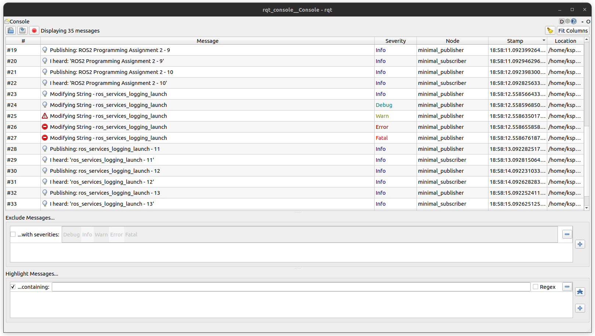
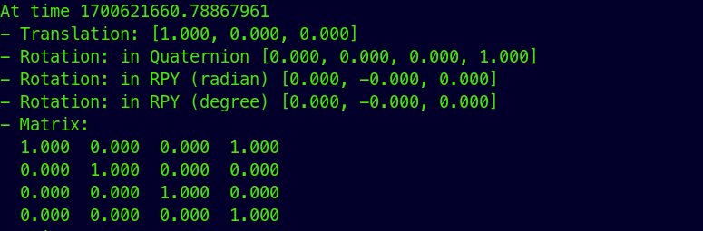

# beginner_tutorials

## ROS 2 Programming Assignment 3 - tf2, unit testing, bag files

### Setup

 - First create a ROS2 [workspace](https://docs.ros.org/en/humble/Tutorials/Beginner-Client-Libraries/Creating-A-Workspace/Creating-A-Workspace.html)

 - Inside the src folder present in the workspace, clone the github repo.
    ```bash
     git clone  https://github.com/kirangit27/beginner_tutorials.git 
     ```

 - [Build](https://docs.ros.org/en/humble/Tutorials/Beginner-Client-Libraries/Colcon-Tutorial.html) the package.
 Navigate back to workspace directory and run the following build command.

    ```bash
     colcon build
   ```

### Execution

### 1: Publisher/Subscriber

 - Running the publisher node.

    ```bash
    ros2 run beginner_tutorials talker
    ```

 - Running the subscriber node.

    ```bash
    ros2 run beginner_tutorials listener
    ```

### 2: Services, Logging, and Launch files
 - Service call to modify published message.
   
   ```bash
   ros2 service call /modify_string beginner_tutorials/srv/NewMsg "{new_msg: Modified base string}"
   ```

 - using launch file (with default publisher frequency, 2.0)

   ```bash
   ros2 launch beginner_tutorials assignment2.launch.py
   ```

 - using launch file (with argument to modify publisher frequency)

   ```bash
   ros2 launch beginner_tutorials assignment2.launch.py freq:=1.0
   ```

 - to view logger levels on rqt_console.

   ```bash
   ros2 run rqt_console rqt_console
   ```

    

### 3: tf2, unit testing, bag files

 - Run the Talker node and verify the TF frames using tf2_echo.
   ```bash
   ros2 run beginner_tutorials talker
   ```
   ```bash
   ros2 run tf2_ros tf2_echo world talk
   ```
    

 - Run the view_frames tool 
   ```bash
   ros2 run tf2_tools view_frames
   ```
   [view frames output](./results/view_frames.pdf)

 - Testing the Talker node 
   ```bash
   colcon test --packages-select beginner_tutorials
   ```
 - launch ROS 2 bag and record all topics
   ```bash
   ros2 launch beginner_tutorials assignment3.launch.py rosbag_record:=True
   ```
   Above command generates a ros2 bag named talker_rosbag in the directory where the command was run.
 - Verify the collected topic messages
   ```bash
   ros2 bag info talker_rosbag
   ros2 bag play talker_rosbag
   ```


Note: 
 - It is assummed that all the dependencies are already present.
dependencies - ROS2 Humble, ament_cmake, rclcpp, std_msgs, rosidl_default_generators, geometry_msgs and tf2/tf2_ros.

